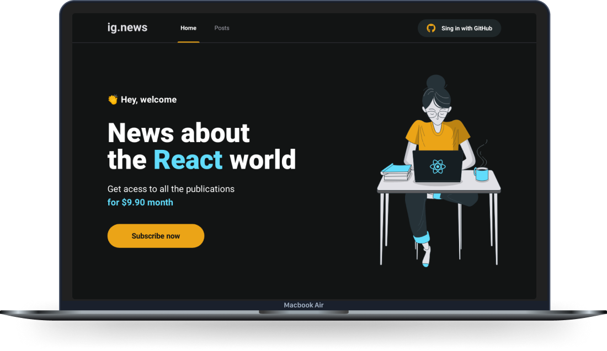

<h1 align="center">
  Ig.news
</h1>

<p align="center">
<a href="#pre-requisitos">Pré-requisitos</a>&nbsp;&nbsp;&nbsp;|&nbsp;&nbsp;&nbsp;
  <a href="#tecnologias">Tecnologias</a>&nbsp;&nbsp;&nbsp;|&nbsp;&nbsp;&nbsp;
  <a href="#projeto">Projeto</a>&nbsp;&nbsp;&nbsp;|&nbsp;&nbsp;&nbsp;
  <a href="#licença">Licença</a>
</p>

<p align="center">
 

  
</p>

<br>

<p align="center">
  
</p>

<a id="pre-requisitos"></a>

## Demonstração da aplicação

Acesse: <https://ignite-ignews-tarcisiodelmondes.vercel.app>

## Pré-requisitos

Antes de começar, você vai precisar ter instalado em sua máquina:

- Git
- Node v16 ou superior
- NPM ou YARN
- Conta no **Stripe**
- Conta no **Fauna**
- Conta no **Prismic**
- Um aplicativo **OAuth Apps** ativo na sua conta do github

### Rodando o ignews

```bash
# Clone este repositório
$ git clone https://github.com/tarcisiodelmondes/ignite-ignews.git

# Acesse a pasta do projeto no terminal/cmd
$ cd ignite-ignews

# Instale as dependências
$ npm install


# Crie um arquivo .env.local e coloque as variáveis de ambiente igual ao .env.example

# Execute a aplicação em modo de desenvolvimento
$ npm run dev
```

<a id="tecnologias"></a>

## 🚀 Tecnologias

Esse projeto foi desenvolvido com as seguintes tecnologias:

- NextJs
- TypeScript
- HTML
- CSS Modules
- SASS
- NodeJS
- Stripe
- Fauna
- Prismic

<a id="projeto"></a>

## 💻 Projeto

Ignews é uma blog com conteúdo premium, para ver todo o conteúdo dos posts é preciso pagar uma assinatura mensal.

<a id="licenca"></a>

## :memo: Licença

Esse projeto está sob a licença MIT. Veja o arquivo [LICENSE](.github/LICENSE.md) para mais detalhes.

---

<p align="center">Feito com 💙 por Tarcisio Delmondes</p>

<br/> :email: &nbsp; Entre em contato comigo: [](https://www.linkedin.com/in/tarcisio-delmondes)

---
